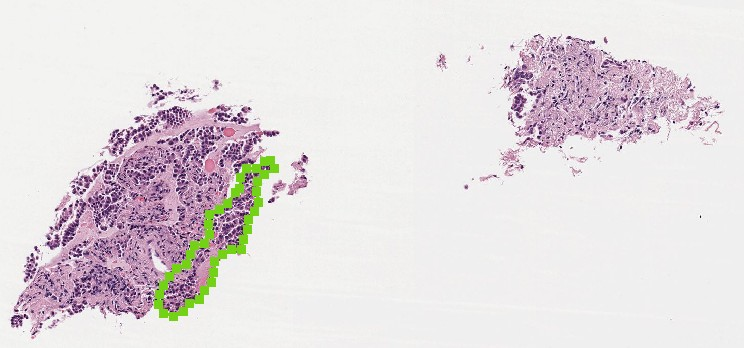
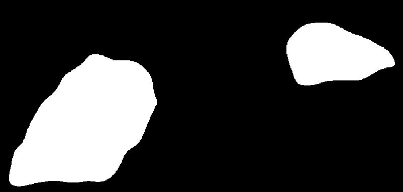
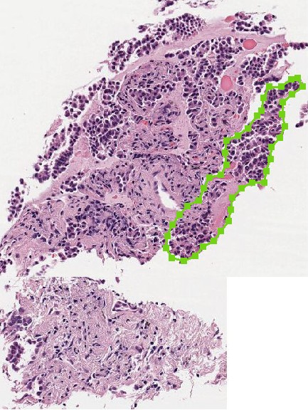

# pathology-whole-slide-packer

Packs tissue sections from one or several slides into a single new slide removing excessive background.
Requires ASAP (https://github.com/computationalpathologygroup/ASAP) and openslide.
Can also pack the corresponding slide annotations in ASAP xml format.

The first step is to create tissue masks to separate background from foreground.
They can be create using the `create_tissue_masks` script. The script was adapted from https://github.com/PingjunChen/tissueloc/blob/master/tissueloc/locate_tissue.py
(Pingjun Chen, MIT License, 2018) and uses otsu thresholding. The tissue masks are saved in a pyramidal tif format 
with 0=background, 1=tissue (not readable by openslide as it can't read one-channel tifs).
You can create your own background masks as normal images, and convert them to tifs with `convert_image` (see below).

After creating the tissue masks, the script `pack_slides.py` will do the packing.

## Example
We pack this small slide with one ASAP annotaton (in green):



First, we create the tissue mask using basic thresholding:
```
python3 wsipack/create_tissue_masks.py --wsi=documentation/assets/example.tif \
--spacing=2 --min_area=0 --out_dir=./out/tissue_masks --overwrite
```
We set here `min_area` (mm²) to zero to also include the smaller fragment, which would be otherwise ignored.
The output is a pyramidal image (tif) of the background/foreground:



Now, with the created tissue mask (example_tissue.tif), we can pack the slide:
```
python3 wsipack/pack_slides.py --data=documentation/assets --mask_dir=./out/tissue_masks \
--anno_dir=documentation/assets --level=0 --min_area=0 --out_dir=./out/packed_example --overwrite
```
This will create several directories containing the packed slide, correpsonding tissue mask
and annotation. Here the packed slide with the corresponding annotation:



## Description

The packing script has two input modes: directory mode and configuration mode.
In the directory mode, `data` is the directory with the slides and `mask_dir` the directory with
the background slides. The names of the masks should start with the corresponding slide names (same for the annotations)

In the configuration mode, `data` is a csv with at least the columns `name`, `path` and `mask_path`
specifying the name of the packed slide to create, the pathes of the slides to be packed and their masks.
This allows to pack multiple slides into one (same name). The packing can be done at any spacing or level present in the slides, 
i.e. `spacing` or `level`. The results will be written to `out_dir`. It will also create convenient symbolic links to open the slides
with ASAP (unless `nolinks` flag is supplied). You can specify a `cache_dir` for 
intermediate files and an input `anno_dir` with ASAP annotation xmls. These will be then packed together with the slides. 

If annotations for the original slides are created after the slides have been packed, you can use the script `pack_annos`.
It expects the original images and annotations and the packed images - directories as input.

## Convert non-pyramidal images and masks to pyramidal

tif mode — convert image to pyramidal tif:
```
python -m wsipack.convert_image tif --data <path> --out_dir <dir> --spacing <float>
```

mask mode — convert mask image using slide spacing:
```
python -m wsipack.convert_image mask --data <path> --out_dir <dir> --slide_dir <dir>
python -m wsipack.convert_image mask --data masks.csv --out_dir <dir> --slide_col slide_path
```

Input types (via `--data`, same pattern as `pack_slides.py`):
- Single file: `/path/to/image.png`
- Directory: scans for images (png, jpg, jpeg, bmp, tif, tiff)
- CSV/XLSX: reads paths from columns (`--path_col`, default `"path"`)


## Acknowledgments
Created in the [#EXAMODE](https://www.examode.eu) project.

